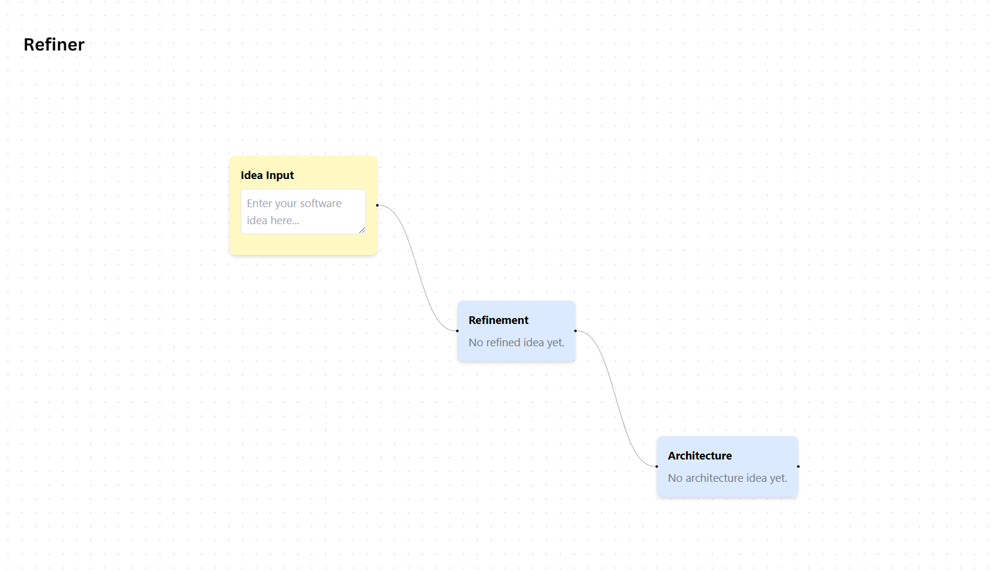

# Refiner

Refiner is a powerful tool designed to transform your initial idea into a well-defined concepts and architectural plans. This project was inspired by V0. Essentially, you tell Refiner your idea in simple terms and it will refine the idea and give you an architecture to work off of. Refiner provides a visual pipeline that helps you:

1. **Input Your Idea**: Start with a rough concept.
2. **Refine the Idea**: Using AI to clarify and enhance your initial idea
3. **Plan the Architecture**: Generate a high-level architectural blueprint based on the refined idea.

4. **[Roadmap Feature] Give you the initial code for the idea**


## Getting Started

1. Clone this repository
```bash
git clone https://github.com/Michaelgathara/gl_challenge
cd gl_challenge
```

2. Acquire [OpenAI API Keys](https://playground.openai.com)
    - Copy the `.env.example` file while renaming to `.env` and paste your API key in the `VITE_OPENAI_API_KEY` slot
    - You can also choose your model of choice

3. Install dependencies:

```bash
npm install # or `pnpm install` or `yarn install`
```

3. Start the development server:

```bash
npm run dev
```

# Usage
1. Enter your idea
    - Navigate to the Idea Input Node.
    - Type in your initial software concept (e.g., "A task management app for remote teams").
    - Optionally, specify the desired tech stack and target audience.
2. Refine your idea
    - Connect the Idea Input Node to the Refinement Node.
    - The AI will process your input, providing a more polished and detailed description.
3. Plan the Architecture
    - Connect the Refinement Node to the Architecture Planning Node.
    - The AI will generate a high-level architectural blueprint, including suggested technologies and file structures.
4. View Results
    - The Output Node displays the refined idea and architectural plan.
    - Review the generated content and make adjustments as needed.

# Technology Stack
- Frontend
    - React
    - React Flow
    - TypeScript
- AI Integration
    - OpenAI APIs
- Styling
    - TailwindCSS

# Project Structure
```bash
refiner/
├── public/
│  
├── src/
│   ├── components/
│   │   └── Logo.tsx 
│   ├── services/
│   │   └── openai.ts
│   ├── edges/
│   │   └── index.ts
|   ├── nodes/
|   │   ├── ArchitectureNode.tsx
|   |   ├── IdeaInputNode.tsx
|   |   ├── index.ts
|   |   ├── types.ts
|   |   └── RefinementNode.tsx 
│   ├── App.tsx
│   ├── main.tsx
│   └── config.ts
├── .env
├── package.json
├── README.md
└── ... 
```

# Future Enhancements
- **MVP Code Generation**: Automate the creation of boilerplate code based on the architecture and refined idea
- **Additional Nodes**: More nodes for things like design planning, user testing, and marketing strategy
- **Code Cleanup**: A lot of the code does not follow the best guidelines for type safety

# License
MIT License